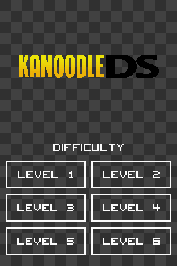

# KanoodleDS

The 2D block-fitting puzzle game reimagined for Nintendo DS!

 

# Development

This game is built on-top the devkitARM toolchain and libnds library, utilizing a standard libnds project template, and developed on a Windows 10 x86-64 system. The game was tested locally using emulators no$gba (Debug Version), melonDS (disabled JIT), and later verified on real hardware via a flash cart.

| Resource | Link |
| - | - |
| devkitARM | https://devkitpro.org/wiki/Getting_Started |
| no$gba | https://www.nogba.com/no$gba-download.htm |
| melonDS | https://melonds.kuribo64.net/ |

Once setup, in the terminal (MSYS2) run Makefile commands `make clean` and `make build`.

The project directory follows the standard libnds template layout, containing a folder for all graphical assets, their accompanying GRIT files for asset conversion, and a C source code folder. Code is divised into a general purpose DLX (exact-cover) solver, polyomino data structures, and the main graphical engine tying puzzle solver, assets and user controls together.

For additional help understanding the libnds C library, NDS console organization, or information on the solving algorithm, see [Additional Resources](#additional-resources) below.

# Additional Resources

As my first serious Nintendo DS game, I learned so much by first gaining familiarity with the NDS architecture and graphics system, allowing effective use of the libnds library. Below, I also provide the source articles detailing the generalistic Dancing Links Algorithm, which allows solving of exact-cover problems much like Kanoodle.

Nintendo DS Architecture
- https://www.copetti.org/writings/consoles/nintendo-ds/

libnds Library
- https://libnds.devkitpro.org/index.html
- https://github.com/devkitPro/grit/blob/master/grit-readme.txt
- https://blocksds.skylyrac.net/
- https://www.patater.com/manual-git/backgrounds.html

Dancing Links Algorithm (Exact-Cover Solver):
- https://en.wikipedia.org/wiki/Dancing_links
- https://arxiv.org/pdf/cs/0011047
